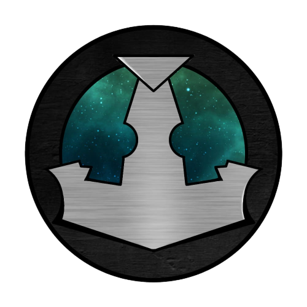

# 🌌 Orbital Voyage

[Watch our Pitch Video on YouTube!]((https://www.youtube.com/watch?v=THQJKJ3J-Ro)

## ⏩ About the game
We have made an interactive platform for astronauts 🚀 that aims to entertain them and keep them healthy 🏋️‍♂️ when they are on mission to the ISS. Through cooperative games, such as a quiz ❓ and exercises guided by Max Cosmo 🌟, our main character, the life of astronauts on mission can be a little more fun. In the Quiz, astronauts will be able to challenge their knowledge of astrophysics 🪐, and in the mini-game, the player will accompany Max Cosmo in his fight for survival ⚔️. The exercise section was created to maintain health in microgravity 🌌. Keeping the mind and body of crew members healthy is essential in long-term missions to avoid mental and physical problems.

By selecting this option, the platform offers a variety of 8 types of specialized exercises 💪, each focused on a specific part of the body, as well as including cardiovascular activities ❤️‍🔥. These exercises are designed to stimulate the physical condition of astronauts by promoting blood circulation 💉, which is crucial in microgravity environments.

Proper blood circulation is essential for maintaining physical health and preventing problems related to inactivity. Therefore, all exercises are carefully selected to meet this need, and clearly, the brave astronaut "Max Cosmos" demonstrates how to do them 👨‍🚀.

Additionally, the platform provides detailed guidance on how to perform each exercise correctly 📋, ensuring that astronauts can practice them effectively and safely.

## ⬇️ How to Install
You will need to have 
- GameMaker
- Git

installed on your machine.

First, clone this repository to your machine.

```
git clone https://github.com/brenovsky/OrbitalVoyage.git
```
After cloning the repository, run the file ``game.yyp`` with the GameMaker software. After that, you only need to run the program in the IDE.

That's it! Enjoy the adventure! 👩‍🚀

## 🎮 How to Play
To start activities on the platform, the player must first select their objective 🎯. He will be offered three options of activities: the quiz, the game 🎮, and the exercises. There are also, in the exercise tab, eight different options for physical activities demonstrated by Max Cosmo 🏋️‍♂️.

## 🏆 About us
We are The Myths Brazil 🇧🇷.

We are a group of undergraduate students in Mechanical Engineering ⚙️, Chemical Engineering 🧪, and Information Systems 💻, who combine diverse skills such as competitive programming 🏆, game development 🎨, astrophysics 🌌, design ✏️, and engineering. Our goal is to create an interactive platform aimed at astronauts 🌠, which allows us to apply and enhance our skills in programming and development. This initiative also gives us the chance to explore new areas and expand our knowledge 📚.

With this project, we want to offer a unique and engaging experience for astronauts 🧑‍🚀, using quizzes ❓, mini-games 🎮, and physical exercise plans 🏋️‍♀️. Our intention is to stimulate both the mind and body 🧠💪, promoting physical and mental health, and making training more dynamic and fun 🎉.

<div style="text-align: center;">

</div>
